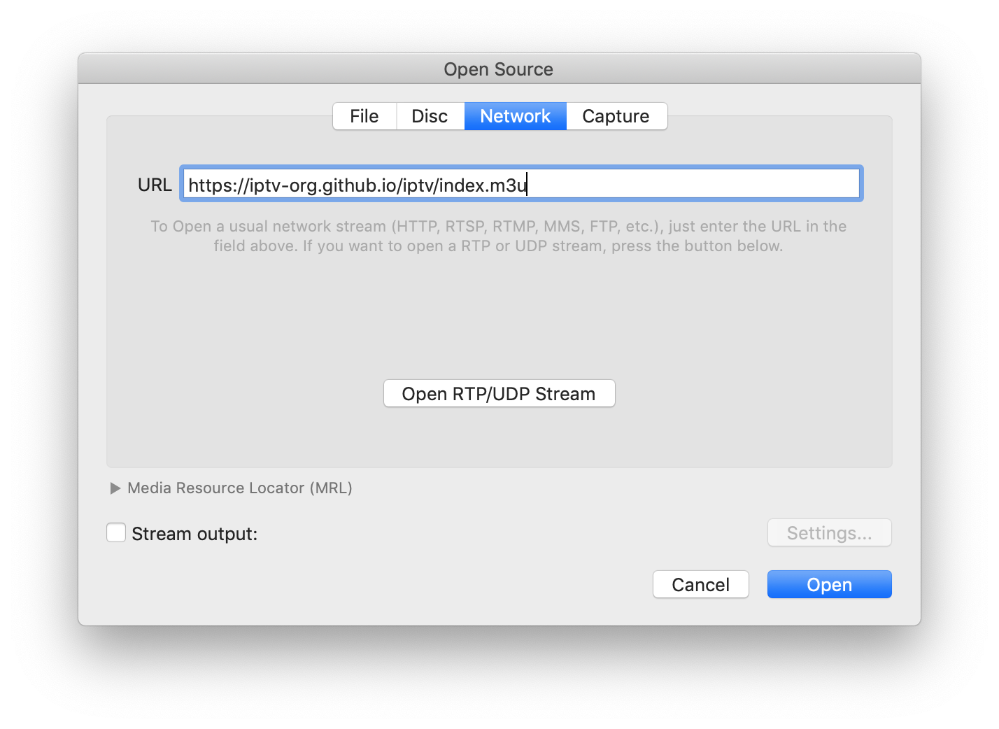

# 📺 YTV — Free IPTV Streams & LG webOS App

> A curated collection of **8,000+ free, publicly available IPTV streams** organized by country, plus a polished **LG webOS Smart TV application** with full remote-control support.



---

## 🌍 Playlists

All streams are provided as **M3U / M3U8** playlists grouped in multiple ways. See [PLAYLISTS.md](PLAYLISTS.md) for the full list.

### Quick-Start URLs

| Grouping | URL |
|---|---|
| By Category | `https://iptv-org.github.io/iptv/index.category.m3u` |
| By Language | `https://iptv-org.github.io/iptv/index.language.m3u` |
| By Country | `https://iptv-org.github.io/iptv/index.country.m3u` |
| By Source (raw) | `https://iptv-org.github.io/iptv/raw/<FILENAME>.m3u` |

> **Tip:** You can load any of these URLs directly into [VLC](https://www.videolan.org/vlc/), Kodi, TiviMate, or any M3U-compatible app.

### Country Streams

Individual country streams live in the [`streams/`](streams/) folder (e.g. `streams/us.m3u`, `streams/in.m3u`, `streams/uk.m3u`). Source-specific playlists are named `<country>_<source>.m3u` (e.g. `streams/us_pluto.m3u`).

---

## 📱 LG webOS Smart TV App

A fully-featured **10-foot living-room UI** application designed for **LG webOS Smart TVs**.

### Key Features

- **🎮 Full Remote Control Support**
  - `CH+` / `CH-` — Next / previous channel with on-screen OSD banner
  - `0–9` — Direct channel number dialling
  - `OK / Enter` — Open visual Channel Guide & EPG drawer
  - `D-Pad` — Up/Down channel cards, Left/Right category switching
  - `Red / Green / Yellow / Blue` — Favorites, Categories, Aspect Ratio, Settings
  - `Magic Remote` — Full air-mouse pointer & click support

- **🖥️ Stunning 10-Foot UI**
  - OLED deep-black styling with glowing focus borders
  - Channel OSD banner: number, logo, name, category, resolution, live clock
  - Channel number dial overlay with countdown timer
  - Category filters: All, News, Sports, Movies, Music, Kids, Entertainment, Favorites

- **⚡ Robust Streaming**
  - Powered by [HLS.js](https://github.com/video-dev/hls.js) with webOS-tuned buffers
  - Automatic error recovery & stream status notifications

- **📡 Playlist Management**
  - Preloaded curated streams from `iptv-org`
  - Built-in country & category feeds (US, UK, India, Germany, France, and more)
  - Custom M3U / M3U8 URL input support

- **🛠️ Developer Tools**
  - Built-in local HTTP dev server with interactive Virtual Remote on PC
  - Official webOS `appinfo.json` and `.ipk` build configuration

### Getting Started (webOS App)

See **[webos-app/INSTALLATION_GUIDE.md](webos-app/INSTALLATION_GUIDE.md)** for complete instructions on:
- Running in a browser for development
- Sideloading onto your LG Smart TV

---

## ☁️ Cloud Hosting

The webOS app is a 100% static web app and can be hosted for free. See **[HOSTING.md](HOSTING.md)** for step-by-step guides for:

| Platform | Config File | URL pattern |
|---|---|---|
| **Vercel** *(recommended)* | `vercel.json` | `https://your-app.vercel.app` |
| **Render** | `render.yaml` | `https://your-app.onrender.com` |

---

## 🛠️ Development Scripts

Requires [Node.js](https://nodejs.org/) installed. Run any script with `npm run <script-name>`.

| Script | Description |
|---|---|
| `api:load` | Download latest channel & stream data from iptv-org API |
| `playlist:format` | Normalise URLs, remove duplicates, sort by name/quality |
| `playlist:update` | Process approved issue requests into playlists |
| `playlist:generate` | Generate all public playlists |
| `playlist:validate` | Check IDs and links for errors |
| `playlist:lint` | Check playlists for M3U syntax errors |
| `playlist:test` | Live-test stream links and report status |
| `playlist:export` | Export streams as JSON for the iptv-org API |
| `readme:update` | Regenerate PLAYLISTS.md |
| `report:create` | Create a report on current open issues |
| `lint` | Lint all TypeScript/JavaScript scripts |
| `test` | Run full test suite |

### Stream Testing Example

```sh
# Test all streams in a country file
npm run playlist:test streams/us.m3u

# Auto-remove broken streams
npm run playlist:test streams/us.m3u --- --fix
```

---

## 📁 Project Structure

```
YTV/
├── .github/          # GitHub Actions workflows & issue templates
├── .readme/          # Assets & template used to generate PLAYLISTS.md
├── scripts/          # All automation scripts (TypeScript)
├── streams/          # Internal M3U playlists by country/source
├── tests/            # Script unit tests
├── webos-app/        # LG webOS Smart TV application
│   ├── css/          # App stylesheets
│   ├── js/           # App JavaScript
│   ├── data/         # Bundled channel data
│   ├── index.html    # App entry point
│   └── appinfo.json  # webOS app manifest
├── CONTRIBUTING.md   # How to contribute streams or fixes
├── FAQ.md            # Frequently asked questions
├── HOSTING.md        # Vercel & Render deployment guide
├── PLAYLISTS.md      # Auto-generated full playlist directory
├── vercel.json       # Vercel deployment config
└── render.yaml       # Render deployment config
```

---

## 🤝 Contributing

We welcome stream additions, fixes, and improvements!

- **Add a stream** — [Open a request](https://github.com/iptv-org/iptv/issues/new?assignees=&labels=streams:add&template=1_streams_add.yml&title=Add%3A+) or submit a pull request.
- **Report a broken stream** — [Fill out the form](https://github.com/iptv-org/iptv/issues/new?assignees=&labels=streams:remove&template=3_streams_report.yml&title=Broken%3A+).
- **Fix metadata** — See the [iptv-org/database](https://github.com/iptv-org/database) repository.

Read **[CONTRIBUTING.md](CONTRIBUTING.md)** for the full guide including the stream description scheme, project structure, and available scripts.

---

## ❓ FAQ

See **[FAQ.md](FAQ.md)** for answers to common questions including:
- Why isn't my channel in the playlist?
- Why are Xtream Codes links not accepted?
- Can I add radio broadcasts?

---

## 📄 License

[MIT License](LICENSE) — free to use, modify, and distribute.

---

*Streams are sourced from publicly available links on the internet. We do not host or serve any video content directly.*
